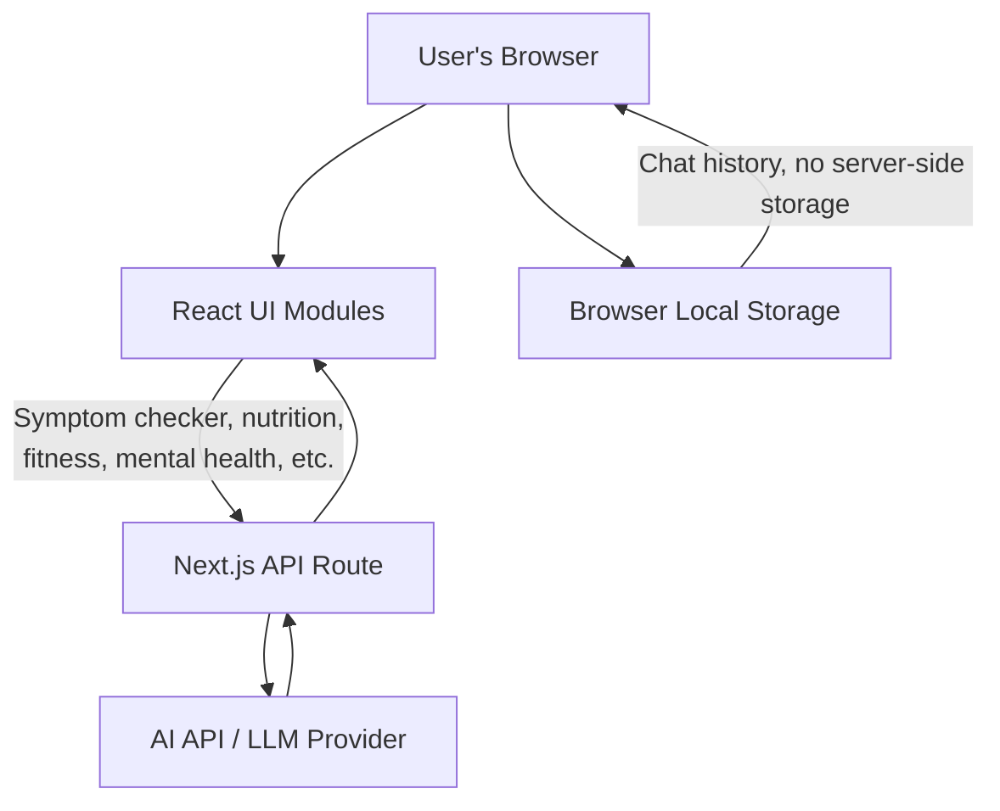

# MediMind AI 🩺🤖

MediMind AI is a modern AI-powered healthcare chatbot built using **Next.js**. It enables users to ask general health-related questions and receive AI-generated responses through a clean, responsive, and intuitive interface.
## 🏗️ Architecture



The app is a Next.js frontend where each health module (symptom checker, nutrition, etc.) sends the user's query to an internal API route. That route formats the prompt and calls the AI provider, then returns the response to the UI. Chat history stays entirely in the browser's local storage — nothing is persisted server-side.

## ✨ Features
- 🤖 AI-powered healthcare chatbot
- 💬 Interactive real-time chat interface
- 📱 Fully responsive design
- ⚡ Fast performance with Next.js
- 🎨 Modern and user-friendly UI
- 🔒 Privacy-focused healthcare assistant

## 🛠️ Tech Stack
- Next.js
- React.js
- TypeScript
- Tailwind CSS
- AI API Integration
- Vercel (Deployment)

## 🚀 Getting Started

1. Clone the repository
   ```bash
   git clone <repository-url>
   ```

2. Install dependencies
   ```bash
   npm install
   ```

3. Run the development server
   ```bash
   npm run dev
   ```

4. Open your browser
   ```
   http://localhost:3000
   ```

## 📂 Project Structure

```
app/
components/
public/
lib/
styles/
```

## 🌐 Live Demo

https://medi-mind-ai-62dx.vercel.app/

## 📌 Disclaimer

MediMind AI is intended for educational and informational purposes only. It does not replace professional medical advice, diagnosis, or treatment.

## 👨‍💻 Author

**Syed Asger Mehdi**
